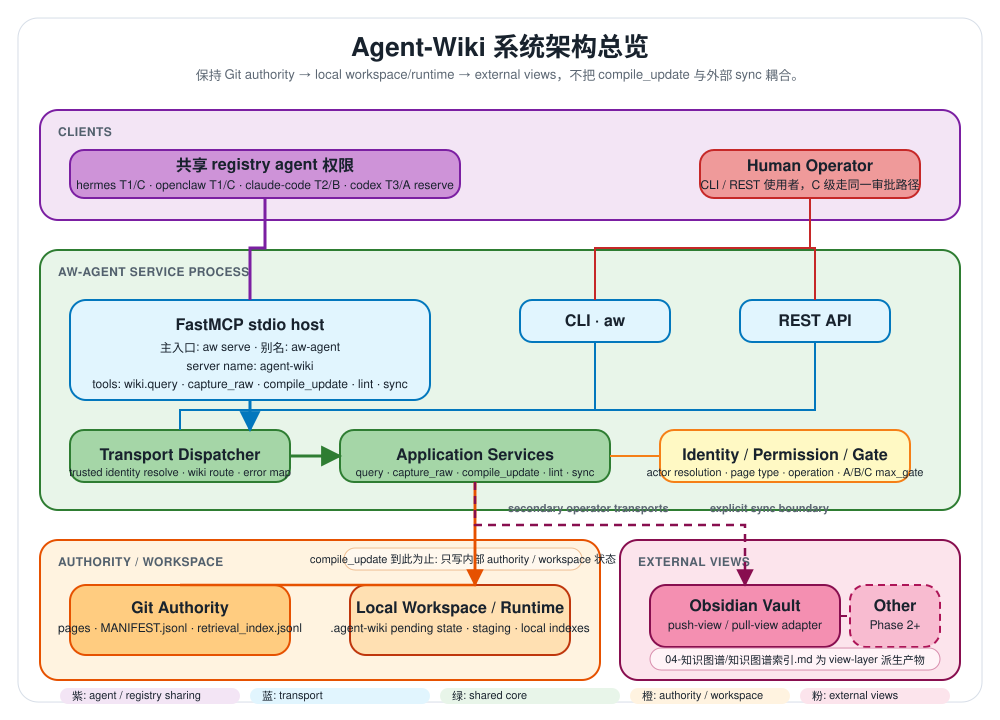
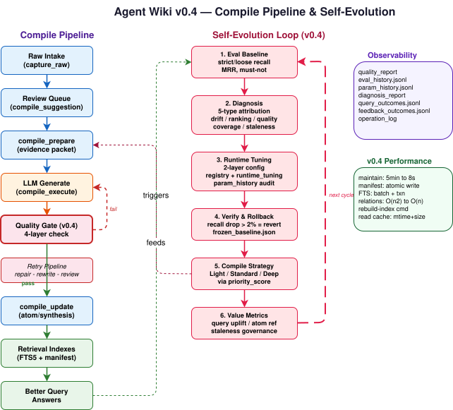
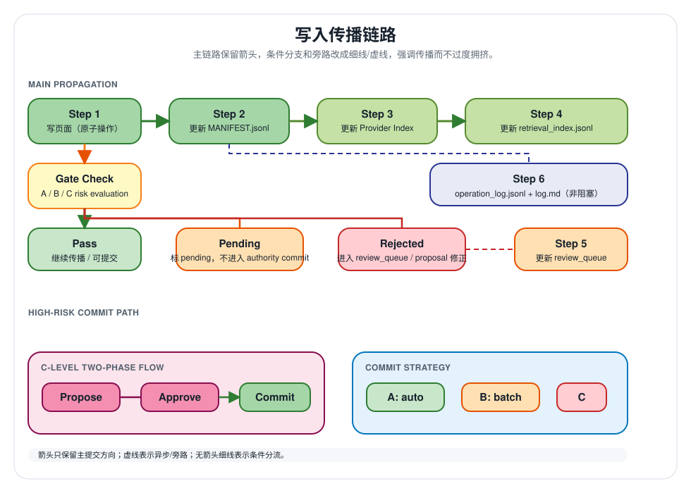
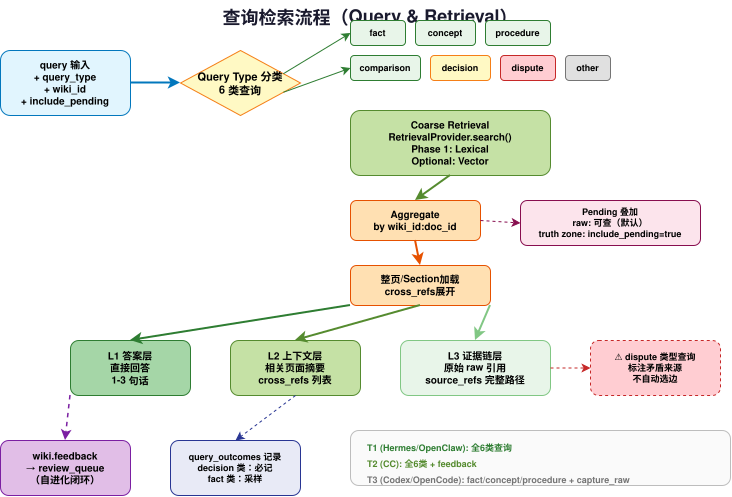

# Agent Wiki

> Version: v0.4.0
> Date: 2026-05-19
> Status: 可工作的多 Agent 知识系统，支持 MCP、CLI、REST、Obsidian 同步、FTS5 检索、图谱可视化、编译质量门、诊断引擎和可控自进化。
>
> 一套知识资产库，多个 Agent 前端：Hermes、Claude Code、Codex、OpenClaw 及其他 Agent 均可通过共享核心服务进行查询、捕获、编译、lint 和同步。

Agent Wiki 是面向长生命周期 AI 记忆的 Agent 无关知识系统。它以工作区为单一事实来源，通过 FastMCP stdio 服务暴露给 Agent，并将 Obsidian 等人类工具保持为同一权限模型下的读写视图。

当前数据基线：**5204 工作区页面**、**4724 条 manifest 记录**、**4723 条索引条目**、**389 项测试通过**。

## 架构总览

### 系统架构



### 编译管道与自进化循环



编译管道将 raw 证据转换为 Agent 工作记忆。主目标是提升 Agent 的检索与推理质量；给人阅读只是次级收益。v0.4 在编译管道中加入了 4 层质量门和重试管线，并将编译结果接入自进化循环：eval → 诊断 → 调参 → 验证 → 编译策略 → 价值度量 → 下一轮。

### 写入传播



### 查询与检索



## 快速集成指南

### 通过 MCP 连接

Hermes 等 MCP 客户端应将 Agent Wiki 作为 stdio sidecar 运行。始终通过环境变量传递显式 actor 身份；请求载荷不得覆盖身份。

```json
{
  "mcpServers": {
    "agent-wiki": {
      "command": "aw",
      "args": ["serve", "--registry", "/Users/chao/agent-wiki-data/registry.yaml"],
      "env": {
        "AGENT_WIKI_ACTOR_TYPE": "agent",
        "AGENT_WIKI_ACTOR_ID": "hermes"
      }
    }
  }
}
```

可用 MCP 工具：

| 工具 | 用途 |
|------|------|
| `wiki.query` | 查询知识库，返回分层结果与调试评分 |
| `wiki.capture_raw` | 捕获 raw 来源或学习笔记 |
| `wiki.compile_prepare` | 为编译准备面向 Agent 的 raw evidence 数据包 |
| `wiki.compile_update` | 创建或修订 `atom` / `synthesis` 页面 |
| `wiki.lint` | 检查 manifest、检索索引、FTS 及一致性健康 |
| `wiki.sync` | 执行显式 `status`、`pull-view` 或 `push-view` 同步 |

### 通过 CLI 连接

```bash
pip install -e ".[dev]"
export AGENT_WIKI_ACTOR_TYPE=agent
export AGENT_WIKI_ACTOR_ID=hermes

aw health --registry /Users/chao/agent-wiki-data/registry.yaml
aw query "MCP integration" --registry /Users/chao/agent-wiki-data/registry.yaml --wiki-id main
```

Obsidian 路由示例：

```yaml
external_views:
  - adapter: obsidian
    mode: read_write
    path: /path/to/vault
    push_view_routing:
      direction_folders:
        agent-os: Agent OS
      fallback_folders:
        raw: raw
        atom: atoms
        synthesis: synthesis
        principle: principles
      graph_index_folder: knowledge-graph
      graph_index_title: Knowledge Graph Index
```

必需环境变量：

| 变量 | 示例 | 含义 |
|------|------|------|
| `AGENT_WIKI_ACTOR_TYPE` | `agent` | registry 权限使用的身份类别 |
| `AGENT_WIKI_ACTOR_ID` | `hermes` | 具体 actor id，如 `hermes`、`claude-code`、`codex` |

### 捕获与查询示例

```bash
aw capture-raw learn-2026-05-17-mcp-integration \
  --topic "agent-os" \
  --problem-cluster "mcp-integration" \
  --content "# MCP 集成笔记\nHermes 应将 agent-wiki 作为 stdio MCP sidecar 运行。" \
  --registry /Users/chao/agent-wiki-data/registry.yaml \
  --wiki-id main

aw query "Hermes 如何连接 agent-wiki？" \
  --registry /Users/chao/agent-wiki-data/registry.yaml \
  --wiki-id main
```

## 架构决策

Agent Wiki 遵循以下权威链：

```text
workspace SSOT -> 本地运行时索引 -> 外部人类视图
```

v0.4.0 核心决策：

- **Workspace = SSOT**：已提交页面、`MANIFEST.jsonl`、`retrieval_index.jsonl`、`topic_index.md`、日志和 review 记录均存放在工作区中。
- **Obsidian = 显示/读写视图**：Obsidian 面向人类。`pull-view` 将编辑导入工作区；`push-view` 将工作区页面导出回 vault。
- **薄传输层**：MCP、CLI 和 REST 调用相同的应用服务和权限门。
- **可信身份解析**：actor 身份来自 MCP 元数据、CLI 环境、token/env 或 registry 回退。调用者不得在工具载荷中设置自身身份。
- **团队扩展模型**：架构支持 N 个个人工作区加 M 个团队工作区，按 actor、wiki、操作、页面类型和 A/B/C 门控分权限层级。
- **编译与检索是一个闭环**：摄入元数据驱动编译候选，编译产物驱动检索，查询 miss 驱动反馈和周度 review。
- **类型化图谱可配置**：`relation_schema.yaml` 定义零 LLM 关系抽取，`maintain` 重建 `knowledge_graph.jsonl`，图谱关系携带 `confidence_label` / `confidence_score` / `source_refs`，模糊关系路由至 `relation_review` 条目。
- **v0.4 编译质量门**：4 层门控（schema 校验 → 必需章节 → claim 覆盖率 → 来源保真度），配合重试管线（transport 重试 → 输出修复 → 质量重写 → 人工 review）。
- **v0.4 诊断引擎**：纯规则归因（5 种类型：`parameter_drift`、`retrieval_ranking_shift`、`compile_quality_degradation`、`coverage_gap`、`staleness`）——无 LLM 依赖。
- **v0.4 运行时调参**：双层配置（`registry.yaml` 稳定默认值 + `runtime_tuning.json` 动态覆盖），配合 `param_history.jsonl` 审计轨迹和 `frozen_baseline.json` 自动回滚。
- **v0.4 可控自进化**：`auto_tune`（白名单、单变量、步长约束、recall 降自动回滚），`compile_strategy`（Light/Standard/Deep 由 `priority_score` 决定），`value_metrics`（编译后查询提升、atom 引用率），`staleness_governance`。

### 编译管道

编译管道将 raw 证据转换为 Agent 工作记忆。完整路径：

```text
raw intake
  -> review_queue compile_suggestion
       -> 优先级排序的开放工作项
  -> aw compile-execute
       -> 认领 compile_suggestion 并输出 compile_prepare JSON
       -> 外部 Agent 写入内容并通过 --input-file 回调
  -> 编译质量门 (v0.4)
       -> 4 层检查：schema、章节、claim 覆盖率、来源保真度
       -> 重试：transport → 输出修复 → 质量重写 → 人工 review
  -> Agent 生成的 compile_update
       -> atom / synthesis truth zone
  -> 检索索引
       -> 更好的查询答案和二阶整理
```

`wiki.compile_prepare` 是只读的。它准备有界的 raw 批次和可追溯的 source refs，但不生成 truth zone 内容。`aw compile-execute` 是 cron 工作者的 CLI 桥接：不带 `--input-file` 或 `--apply` 时，认领建议并输出 JSON evidence 数据包；带 `--input-file` 时，通过 `compile_update` 应用生成内容；带 `--apply` 时，一条命令完成完整循环：prepare → 调用 OpenAI 兼容 API → 应用 atom 页面 → 解决或失败队列项。

`--apply` 需要在 registry 的 wiki 下配置：

```yaml
compile:
  llm:
    base_url: https://openrouter.ai/api/v1
    api_key_env: OPENROUTER_API_KEY
    model: deepseek/deepseek-chat-v3-0324
    max_tokens: 4096
    timeout_seconds: 30
    max_retries: 3
    retry_delays: [10, 30, 60]
    concurrency: 1
```

## v0.4.0 新特性

### Phase A：评测基线
- `aw eval` / `aw eval-retrieval` 现在计算 strict recall、loose recall、must-not violation、MRR 和 compiled hit ratio。
- `eval_history.jsonl` 记录每次评测的完整指标、逐查询结果和运行时调参快照，用于回归检测。
- `quality_report` 扩展：`atom_field_completeness`、`section_structure_compliance`、`source_ref_coverage`、`eval_baseline`。
- 实际基线：strict_recall@5=0.479, loose_recall@5=0.542, must_not_violation@5=0.0, MRR=0.371。

### Phase B：编译质量门
- 新增 `CompileQualityGate` 服务：每次编译输出经过 4 层检查（schema → 必需章节 → claim 覆盖率 → 来源保真度）。
- `compile_prepare` 增强：动态 token 预算、已有 atom 上下文注入、句子级 evidence 提取。
- 重试管线：无效输出 → 输出修复；质量拒绝 → 质量重写；然后人工 review。

### Phase C：诊断与调参循环
- 新增 `DiagnosisService`：纯规则归因引擎，5 种类型——`parameter_drift`、`retrieval_ranking_shift`、`compile_quality_degradation`、`coverage_gap`、`staleness`。
- 新增 `RuntimeTuningService`：双层配置（`registry.yaml` 默认值 + `runtime_tuning.json` 覆盖）。所有参数变更记录到 `param_history.jsonl`。
- `frozen_baseline.json`：基线时刻的评测指标快照，用于回滚检测。
- 负面反馈在 review queue 中创建 `feedback_issue` 条目，并回写到 `query_outcomes.jsonl`。
- maintain 中的重复 atom 检测：近似重复 atom 标记为警告。

### Phase D：可控自动化
- `compile_strategy`：Light（仅摘要提取）、Standard（默认）、Deep（3 轮重编译）——由 `priority_score` 选择。
- `auto_tune`：单变量、白名单约束、步长受限。recall 下降 >2% 时自动回滚。默认禁用；需要 `--auto-tune` 标志。
- `value_metrics`：编译后查询提升、atom 引用率、过期治理。
- `staleness_governance`：热点过期文档自动入队刷新。

### 基础设施改进
- `aw rebuild-index`：移除孤立索引条目，从 manifest 重建 FTS。
- `aw maintain` 性能：5分钟+ → 8s（批量写入、FTS 事务、O(n²)→O(n) 关系计算）。
- 原子 manifest 写入（temp+fsync+rename）、NUL 容错读取、读缓存。

### v0.2.0 特性（保留）
- FTS5 全文搜索、查询排名调试评分、查询结果日志。
- 索引一致性健康检查、doc_id 迁移、Obsidian push-view 路由、知识图谱可视化。

## 运行时接口

### CLI

| 命令 | 用途 |
|------|------|
| `aw info` | 显示包/运行时信息 |
| `aw health` | registry 加载、actor 解析和工具列表自检 |
| `aw serve` | 启动 FastMCP stdio 服务 |
| `aw query` | 查询知识库 |
| `aw eval` / `aw eval-retrieval` | 运行检索质量评测，含 strict/loose recall、must-not violation、MRR |
| `aw rebuild-index` | 移除孤立索引条目，从 manifest 重建 FTS（v0.4） |
| `aw capture-raw` | 捕获 raw 来源或学习笔记 |
| `aw compile-prepare` | 为编译准备面向 Agent 的 raw evidence 数据包 |
| `aw compile-execute` | 认领编译建议、输出 JSON 数据包、从 `--input-file` 应用生成内容，或用 `--apply` 单命令完成 LLM 编译 |
| `aw compile-update` | 创建或修订编译 truth zone 页面 |
| `aw review-queue-consume` | 分配指定类型的下一个开放 review queue 项 |
| `aw review-relations` | 解决、拒绝或重新分类类型化图谱关系 review 项 |
| `aw lint` | 运行一致性检查 |
| `aw sync status` | 检查外部视图同步状态 |
| `aw sync pull-view` | 将外部视图编辑导入工作区 |
| `aw sync push-view` | 将工作区页面导出到外部视图 |
| `aw feedback` | 记录查询或内容反馈 |
| `aw weekly-review` | 生成维护 review 摘要 |
| `aw dream-cycle` | 运行深度维护：孤立扫描、交叉引用分析、综合合成和质量 review |
| `aw approvals propose/approve/reject` | C 级 proposal 工作流 |
| `aw maintain` | 运行自进化循环：修复、编译建议、关系、质量报告、诊断、调参（v0.4：`--auto-tune` 标志） |

### MCP

主要 Agent 路径是通过 `aw serve` 的 MCP stdio。MCP 接口故意保持精简：

```text
wiki.query
wiki.capture_raw
wiki.compile_prepare
wiki.compile_update
wiki.lint
wiki.sync
```

### REST

REST 是本地工具和测试的辅助传输层。它暴露了查询、捕获、编译准备/更新、review queue 消费、lint、同步、反馈、周度 review、审批和健康检查的工作流对等接口，但 Hermes 集成应优先使用 MCP stdio。

## 检索与知识流

```text
capture_raw / pull-view
  -> 元数据规范化
  -> pages/*.md + MANIFEST.jsonl
  -> retrieval_index.jsonl + .agent-wiki/retrieval.db
  -> topic_index.md
  -> 查询排名 + 调试评分
  -> 反馈 / 周度 review / 编译积压
```

检索当前组合了来自 `knowledge_graph.jsonl` 的类型化图谱命中、FTS5 字段加权匹配、`topic_index.md` 的结构化元数据、JSONL 词法回退、purpose 感知排名、页面类型提升和新鲜度。类型化图谱命中按置信度加权：`EXTRACTED` 全权重，`INFERRED` 降权，`AMBIGUOUS` 关系排除出检索并送入 review。向量搜索仍为插件级增强而非基线。

## Obsidian 工作流

Obsidian 是人类编辑和阅读界面，不是权威。工作区保持权威。

- `aw sync pull-view` 递归读取 Markdown 文件，忽略 `.obsidian` 和回收站文件夹，保留 vault 相对路径，清理 frontmatter，将成功的 raw 页面导入 manifest 和检索索引。
- `aw sync push-view` 按可配置类别路由将工作区页面导出到 vault，尽可能保留 frontmatter。
- Obsidian 图谱索引输出默认为 `knowledge-graph/index.md`；vault 特定目录和标题应写在 `external_views[].push_view_routing` 中。

## 仓库结构

```text
agent-wiki/
├── README.md
├── README.zh-CN.md
├── AGENTS.md
├── pyproject.toml
├── Dockerfile
├── knowledge-graph.html
├── serve_graph.sh
├── core/
│   └── schema.md
├── docs/
│   ├── ROADMAP.md
│   ├── design.md
│   ├── requirements-and-architecture.md
│   ├── architecture/
│   └── specs/
├── src/agent_wiki/
│   ├── application/
│   │   ├── capture_raw.py, compile_update.py, query.py
│   │   ├── compile_suggest.py, compile_prepare.py, compile_execute.py
│   │   ├── compile_quality_gate.py    # v0.4 Phase B
│   │   ├── diagnosis.py               # v0.4 Phase C
│   │   ├── runtime_tuning.py          # v0.4 Phase C
│   │   ├── maintenance.py             # v0.4: rebuild-index, auto_tune, staleness
│   │   ├── eval_retrieval.py          # v0.4 Phase A
│   │   ├── quality_report.py          # v0.4: atom metrics, eval baseline
│   │   └── feedback.py, sync.py, linting.py, weekly_review.py, approvals.py
│   ├── bootstrap/
│   ├── domain/
│   ├── infrastructure/
│   │   ├── adapters/
│   │   ├── identity/
│   │   ├── migrations/
│   │   ├── retrieval/
│   │   ├── runtime/
│   │   └── storage/
│   └── transports/
│       ├── cli/
│       ├── mcp/
│       └── rest/
└── tests/
    ├── fixtures/
    └── test_*.py
```

运行 `./serve_graph.sh` 在 `:8765` 启动图谱可视化器的本地 HTTP 服务。

## 开发

安装并验证：

```bash
python3 -m venv .venv
. .venv/bin/activate
pip install -e ".[dev]"
pytest -q
```

当前验证套件：**389 项通过**。

实用运维检查：

```bash
aw health --registry /Users/chao/agent-wiki-data/registry.yaml
aw lint --registry /Users/chao/agent-wiki-data/registry.yaml --wiki-id main
aw sync status --registry /Users/chao/agent-wiki-data/registry.yaml --wiki-id main
```

## 文档索引

- `docs/specs/knowledge-system-architecture.md` — 摄入、编译、检索和维护的权威终态模型。
- `docs/design.md` — 当前基线与目标设计。
- `docs/requirements-and-architecture.md` — 需求、阶段边界和架构约束。
- `docs/ROADMAP.md` — v0.2+ 执行顺序和已知问题。
- `docs/superpowers/specs/2026-05-19-v0.4-compile-quality-and-self-evolution-design.md` — v0.4 编译质量门和自进化设计规范。
- `docs/deployment/hermes-mcp.md` — Hermes MCP sidecar 配置。
- `core/schema.md` — 操作和 schema 契约。

## License

MIT
