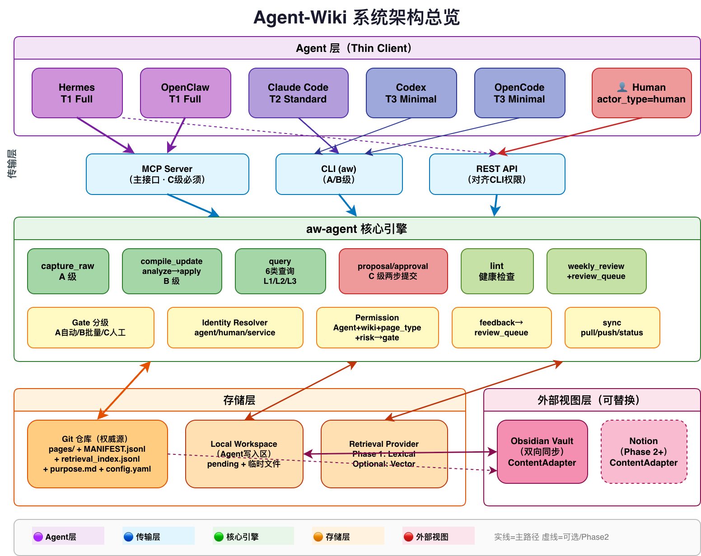
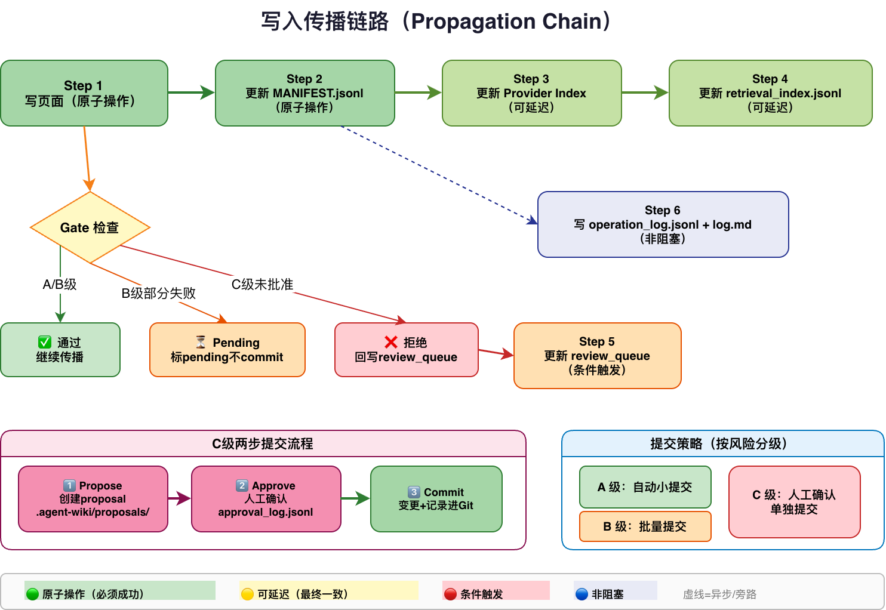
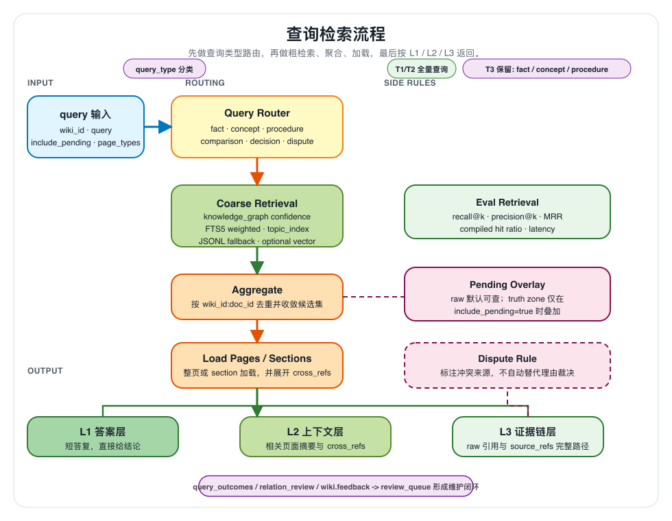
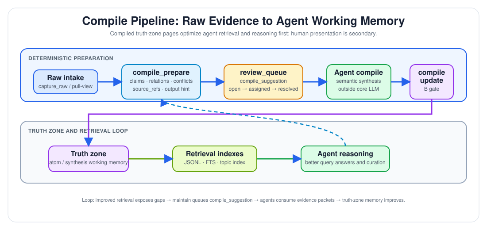

# Agent Wiki

> Version: v1.2  
> Date: 2026-05-16  
> Status: 与当前 Phase 1 实现对齐的仓库总览
>
> 面向 AI Agent 的通用、Agent 无关知识系统。
>
> 一套知识资产库，多个 Agent 前端：Hermes 可以搜索，Claude Code 可以更新，Codex 可以查询，OpenClaw 可以维护，OpenCode 可以复用。

Agent Wiki 是 **个人多 Agent 知识工作流** 的 Phase 1 实现，围绕共享核心引擎、Git 优先的权威模型，以及轻量 Agent 适配器构建。

## Why this exists

大多数 Agent 知识系统都紧耦合在单一工具、单一记忆机制或单一 UI 上。Agent Wiki 走的是另一条路线：

- **知识应当超越当前 Agent 会话持续存在**
- **多个 Agent 应当能操作同一个知识库**
- **Git 应保持记录权威**
- **检索、编译和维护应当是显式工作流，而不是隐藏的 prompt 技巧**

Phase 1 的核心闭环是：

```text
capture_raw → compile_update → query → lint → sync → weekly-review
```

## Architecture at a glance

### System overview



### Write propagation



### Query and retrieval flow



### Compile pipeline



编译管道把 raw 证据转换为 Agent 工作记忆。主目标是提升 Agent 的检索、推理与二阶整理质量；给人阅读只是次级收益。完整路径是：raw intake → `compile_prepare` → review queue → Agent 生成并调用 `compile_update` → truth zone → 更好的 retrieval。

> 说明：以上图表位于仓库 `docs/architecture/` 下，反映当前 Phase 1 实现方向；部分未来的 MCP/REST 与更丰富的传播行为仍以设计目标形式记录。

## What Agent Wiki does

### 当前 Phase 1 基线已实现的运行时子系统

以下子系统已经存在于当前 `src/agent_wiki/` 运行时实现中：

- Python 包 `agent_wiki`，其 Phase 1 核心位于 `src/agent_wiki/`，并有测试支撑
- 基于 registry 的多 wiki 配置加载
- 原始捕获流程（含 committed 写入与 pending 回退）
- `atom` 与 `synthesis` 的编译更新流程
- 基于 `retrieval_index.jsonl` 的词法检索
- 分层查询结果（L1 / L2 / L3 输出）
- 查询上下文中的争议提示
- 仅在显式请求时包含 pending truth-zone
- manifest 持久化与 retrieval index 更新
- manifest/page 与 manifest/index 一致性 lint 检查
- `status`、`pull-view`、`push-view` 文件系统同步流程
- feedback 记录与 review queue 插入
- weekly review 摘要生成
- C 级 proposal / approval smoke path
- shared wiki 限制与 cross-wiki query 的 smoke 覆盖
- 截至 2026-05-16 的当前 M1-M6 基线共 32 个通过测试

### 当前已可调用的接口面

当前可调用的用户 / Agent 接口面刻意保持很小：

- `src/agent_wiki/transports/cli/app.py` 中的最小 CLI stub
- `aw --help`
- `aw info`

这足以检查 packaging 与 runtime wiring，但它**还不是**完整工作流 CLI，也不是一个可部署的长驻 `aw-agent` 服务。

### 已设计但尚未完整实现

- MCP 传输层
- REST 传输层
- 针对 `max_gate` 的完整 gate 执行
- 相比 caller-supplied actor fields 更高优先级的可信身份解析
- 面向 Git-first governance 的 authority-promotion / commit orchestration
- 回滚 / stale-marker 传播恢复模型
- 页面级 sensitivity schema 与查询过滤
- 更丰富的 schema/frontmatter 校验
- 更丰富的 review queue 工作流字段
- 向量 provider 路由与 load-budget 执行
- 超出 copy-based Phase 1 行为的 adapter-specific reverse sync 语义

## CLI surface today

| Command | Status | Notes |
|---|---|---|
| `aw --help` | Implemented | package/CLI 帮助界面 |
| `aw info` | Implemented | 最小运行时信息桩接口 |
| `aw capture-raw` | Planned | application service 已存在，但命令接口未实现 |
| `aw compile-*` | Planned | application service 已存在，但命令接口未实现 |
| `aw query` | Planned | application service 已存在，但命令接口未实现 |
| `aw lint` | Planned | application service 已存在，但命令接口未实现 |
| `aw sync` | Planned | application service 已存在，但命令接口未实现 |
| `aw feedback` | Planned | application service 已存在，但命令接口未实现 |
| `aw weekly-review` | Planned | application service 已存在，但命令接口未实现 |
| `aw serve` | Not started | 在 `aw-agent` 成为真实长驻服务前必须实现 |

## Core design principles

- **Git is the authority** — 已提交知识以 Git 可见工件形式存在
- **Workspace is runtime state** — 本地 pending 状态、proposal 与维护元数据位于 `.agent-wiki/` 下
- **Write = propagate** — 写入不仅是页面编辑，还会更新 manifest、retrieval、日志与 queue 状态
- **Compile before retrieve** — 原始来源先喂给编译产物，检索在编译产物之上运行
- **Agent adapters stay thin** — 核心行为属于共享引擎，而不是单个 Agent 集成

## Phase 1 global priorities

整个文档套件的规范优先级顺序是：

- **P0** — 可用的查询质量与 Obsidian-connected workflow
- **P1** — 知识生命周期自动化与 purpose 驱动演化
- **P2** — 面向更强多 Agent 声明的治理硬化
- **P3** — 权威路径 / 可部署性 / 运维成熟度

这个顺序反映了 Codex、Claude Code 与 Tao 三方视角的综合结论：Phase 1 必须先可用，再可自我演化，然后才能为更强声明提供足够治理保障。

## Gate model

规范的运行时 gate 模型是：

- **A** — raw/source capture
- **B** — atom/synthesis/dispute 更新
- **C** — principle 与其他高风险写入

`D` 仅保留为 DFX maintenance/design note，**不是**正式运行时 gate level。

## Agent capability matrix

| Agent | Tier | Transport | Current Phase 1 capability | Constraints |
|---|---|---|---|---|
| Hermes | T1 Full | MCP / CLI 设计目标 | 完整工作流设计目标 | 最强集成目标，但本仓库尚未实现 |
| Claude Code | T2 Standard | 当前 CLI，后续 MCP | capture、compile、query、lint、sync 触发工作流 | 无内建调度器或向量搜索 |
| Codex | T3 Minimal | CLI `aw` + identity profile | query、capture_raw | 无 MCP、无持久状态 |
| OpenClaw | T1 Full | MCP / CLI 设计目标 | 完整工作流设计目标 | 基于 prompt 的 skill 环境 |
| OpenCode | T3 Minimal | CLI wrapper | query、capture_raw 风格流程 | 无持久状态 |

更详细的按 Agent 说明见 `docs/agent-differences.md`。

## Current implementation map

当前运行时实现位于 `src/agent_wiki/` 下，并按子系统组织。

### Bootstrap and configuration

- `src/agent_wiki/bootstrap/registry_loader.py` — registry 与 wiki 配置加载
- `src/agent_wiki/bootstrap/container.py` — 最小服务容器
- `src/agent_wiki/settings.py` — 默认路径

### Application services

- `src/agent_wiki/application/capture_raw.py` — A 级原始捕获
- `src/agent_wiki/application/compile_update.py` — B 级编译更新
- `src/agent_wiki/application/query.py` — 词法查询管线与 cross-wiki query
- `src/agent_wiki/application/linting.py` — Phase 1 lint 检查
- `src/agent_wiki/application/sync.py` — `status`、`pull-view`、`push-view`
- `src/agent_wiki/application/feedback.py` — feedback 采集与 queue 创建
- `src/agent_wiki/application/weekly_review.py` — weekly 摘要生成
- `src/agent_wiki/application/approvals.py` — C 级 proposal 与 approval smoke path
- `src/agent_wiki/application/propagation.py` — 写入传播编排

### Domain and contracts

- `src/agent_wiki/domain/models.py` — 类型化输入/输出
- `src/agent_wiki/domain/contracts.py` — 运行时契约与命中形状
- `src/agent_wiki/domain/enums.py` — gate、page type、actor 枚举

### Infrastructure

- `src/agent_wiki/infrastructure/storage/manifest_repo.py` — manifest JSONL 持久化
- `src/agent_wiki/infrastructure/retrieval/retrieval_index.py` — retrieval index 写入与词法搜索
- `src/agent_wiki/infrastructure/runtime/pending_state.py` — pending manifest 状态
- `src/agent_wiki/infrastructure/runtime/review_queue.py` — review queue JSONL 追加
- `src/agent_wiki/infrastructure/runtime/operation_log.py` — operation log JSONL 追加
- `src/agent_wiki/infrastructure/identity/*.py` — identity、permission 与 gate 辅助模块

### Transport

- `src/agent_wiki/transports/cli/app.py` — 当前 CLI stub surface

### Legacy / non-authoritative paths

- `engine/` 仍存在于仓库中，但它不是当前 Phase 1 基线的权威运行时实现路径。
- 除非仓库后续明确重新引入 `engine/` 作为受支持路径，否则贡献者应把 `src/agent_wiki/` 视为活动运行时树。

## Repository structure

```text
agent-wiki/
├── README.md
├── pyproject.toml
├── Makefile
├── Dockerfile
├── src/agent_wiki/
│   ├── application/
│   ├── bootstrap/
│   ├── domain/
│   ├── infrastructure/
│   └── transports/
├── tests/
│   ├── fixtures/
│   └── test_*.py
├── core/
│   ├── schema.md
│   └── schema.zh-CN.md
├── docs/
│   ├── design.md
│   ├── design.zh-CN.md
│   ├── requirements-and-architecture.md
│   ├── requirements-and-architecture.zh-CN.md
│   ├── agent-differences.md
│   ├── architecture/
│   └── reviews/
└── .agent-wiki/
    └── plans/
```

## Quick Start

### 1. Clone and run tests

```bash
git clone https://github.com/<your-org>/agent-wiki.git
cd agent-wiki
python3 -m pytest
```

### 2. Inspect the current CLI surface

```bash
python3 -m agent_wiki.transports.cli.app --help
python3 -m agent_wiki.transports.cli.app info
```

或在本地安装后：

```bash
pip install -e .
aw --help
aw info
```

### 3. Review the design baseline

如果你想理解设计与实现上下文，请从这里开始：

- `docs/design.md`
- `docs/requirements-and-architecture.md`
- `core/schema.md`
- `docs/agent-differences.md`
- `docs/superpowers/specs/2026-05-16-phase-1-design.md`
- `docs/reviews/`

## Example workflows

### Raw capture

Phase 1 当前在 `src/agent_wiki/application/capture_raw.py` 中实现原始捕获。

概念流程：

```text
raw note/source
  → 校验 doc_id
  → 写入 pages/{doc_id}.md
  → 追加 MANIFEST.jsonl
  → 追加 retrieval_index.jsonl
  → 追加 log.md
```

无效 raw doc ID 不会被提交，而是回退到 `.agent-wiki/pending_manifest.jsonl` 中的 pending 状态。

### Compile update

编译更新当前在 `src/agent_wiki/application/compile_update.py` 中支持 `atom` 和 `synthesis`。

概念流程：

```text
compile_update analyze
  → 查找现有文档或匹配的问题簇
  → 分类为创建 vs 修订
  → 校验 source_refs
  → 传播编译页 + manifest + retrieval + logs
```

### Query

当前查询路径是基于词法的文件后端路径：

```text
query
  → 分类查询类型
  → 在 retrieval_index.jsonl 上进行词法搜索
  → 可选纳入 pending truth-zone
  → 基于 manifest 过滤和排序
  → L1 answer + L2 context + L3 proof
```

## Documentation guide

- `docs/design.md` — 架构设计与实现对齐
- `docs/requirements-and-architecture.md` — 需求基线与阶段边界决策
- `core/schema.md` — 操作契约与 schema 预期
- `docs/agent-differences.md` — 各 Agent 适配说明
- `docs/reviews/` — 内部评审材料与评审回应

## Testing status

当前仓库基线包含以下里程碑的通过测试：

- scaffold and bootstrap
- raw capture and propagation
- compile analyze/apply
- lexical query and layered output
- lint、sync、feedback、weekly review
- approvals、shared wiki、multi-wiki 与 cross-wiki smoke paths

运行完整测试套件：

```bash
python3 -m pytest
```

## Roadmap

### P0 — Must be usable

- 为真实使用场景增强词法检索质量
- 增加中文分词与模糊匹配
- 在 query path 中加入 hit/miss tracking
- 将 Obsidian-connected workflow 作为真实 adoption path 交付

### P1 — Must keep knowledge evolving

- 当 raw 页面按 topic/problem cluster 累积时生成 auto-compile suggestion
- 对重复低价值查询增加 fast feedback trigger
- 让 `purpose.md` 影响 ranking、compile direction 与 health evaluation
- 增加低成本 candidate relations，例如 co-occurrence 与 cross-reference

### P2 — Must support stronger governance claims

- 执行可信身份优先级
- 中央化执行 `max_gate`
- 增加页面级 sensitivity policy 与 filtering
- 扩展 review queue lifecycle records

### P3 — Must complete authority and operational maturity

- 增加 authority-promotion / commit orchestration
- 实现 `aw serve` 与真实的长驻服务路径
- 深化 DFX readiness criteria 与 runbook

## Honest status note

本仓库目前已经有一个可工作、经过测试的 **Phase 1 基线实现**，但它还没有达到设计文档中描述的完整终态架构。特别是 MCP/REST、更丰富的传播保证、更深的 schema 执行，以及真实的长驻服务 surface 仍然是设计目标，而不是完全实现的运行时特性。

这种分叉是有意的：项目从 Phase 2 终局架构出发设计，但在 Phase 1 中逐步落地。

## License

MIT
